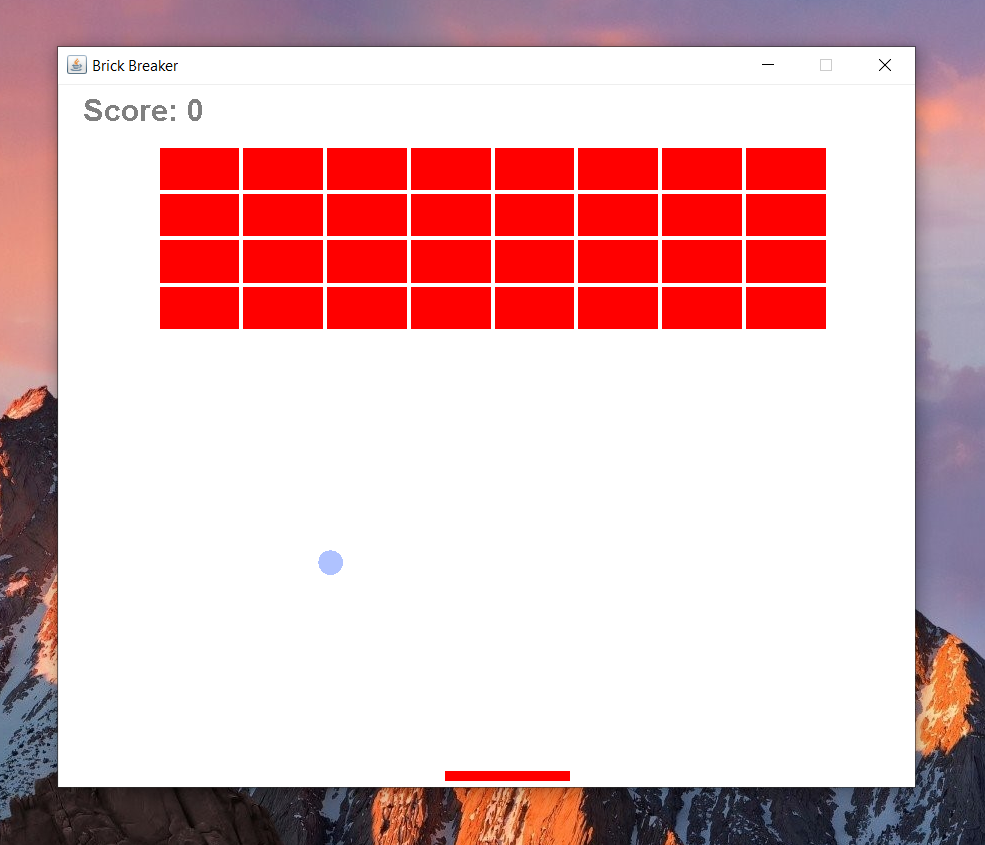

# brickBreaker
Classic Brick Breaker game written in java. Please submit bug reports as needed.

# Prerequisites
JDK installed on machine

# Installation (does not include AI mode)
1.) Click on the file with the .jar extension
 
2.) Click on download (area on right)
 
3.) Click on the downloaded file and game should run

# Game Instructions
Right arrow key (→) moves paddle to the right
 
Left arrow key (←) moves paddle to the left
 
Enter key restarts game once you have lost
 
 
To play in AI mode, you must first clone this repository
in an IDE (or through terminal if you know how to build the project)
and use the command-line parameter of "AI" (capitalization does not matter).
The paddle will move automatically and win the game. A decision tree was used
to implement this movement.
